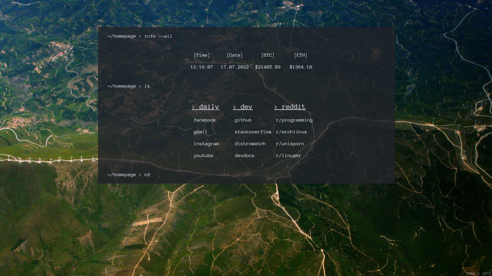

# Homepage

Hi, here you can find my custom, handmade homepage. I got inspired by [Peyrzival](https://github.com/Peyrzival) and his build. The page is kept in terminal style, with background power by [Lorem Picsum](https://picsum.photos/), DuckDuckGo search engine and live BTC ETH price power by [Binance API](https://www.binance.com/en/binance-api).

## Make it your own

<details>
<summary><strong>Background image</strong></summary>

In order to change background image (set it static or change API) edit line 42 in `/script/index.js`.
```js
body.style.backgroundImage = `url(YOUR_IMAGE_URL)`;
```
</details>

<details>
<summary><strong>Search engine</strong></summary>

DuckDuckGo is my favorite, but if you want to set, lest say Google, edit line 48 in `/script/index.js`.
```js
    window.open(`YOUR_SEARCH_ENGINE_URL${searchValue.value}`, "_self")
```
</details>

<details>
<summary><strong>Time/Data format</strong></summary>

To change the format, edit line 35/39 in `/script/index.js`. Swap `'pl-PL'` into something else, for example `'us-US'`.
</details>

<details>
<summary><strong>Crypto display</strong></summary>

<div align="center" style="color: #e06c75">

**!!! READ API [DOCUMENTATION](https://binance-docs.github.io/apidocs/spot/en/#websocket-market-streams) FIRST !!!**
</div>

Everything about binance web socket api you can find [here](https://binance-docs.github.io/apidocs/spot/en/#websocket-market-streams). In order to change anything check lines 7-17 or 19-29 in `/script/index.js`. Focus mainly:
```js
let ws = new WebSocket("wss://stream.binance.com:9443/ws/btcusdt@kline_5m");
```
```js
let price = parseFloat(stockObject.k.h).toFixed(2);
```
In those lines you can swap `'btcusdc'` to pair you like, `'@kline_5m'` to some others interval or type. If you change the type, you will probably have to change also `stockObject.XXX` to something else. 
</details>

<details>
<summary><strong>Links</strong></summary>

All URLs I have used you can find in `index.html` starting from line 44. Just swap href and title to whatever you like ;-)
</details>

# Screenshot
